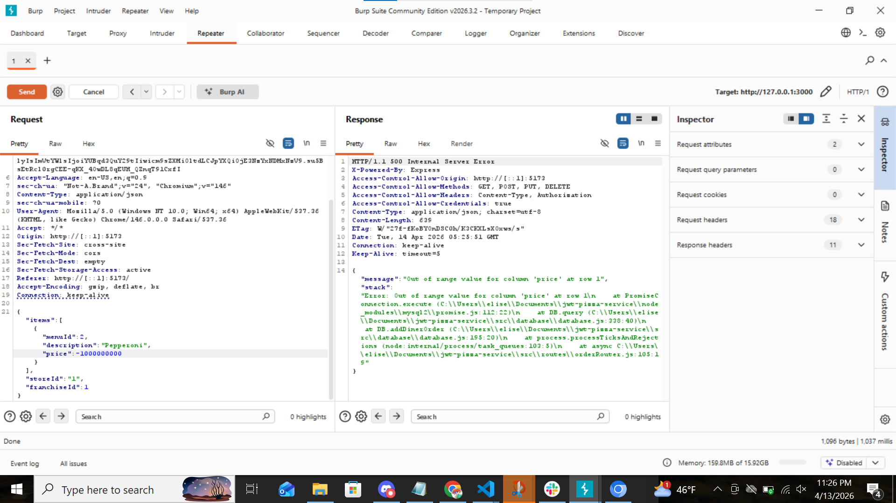
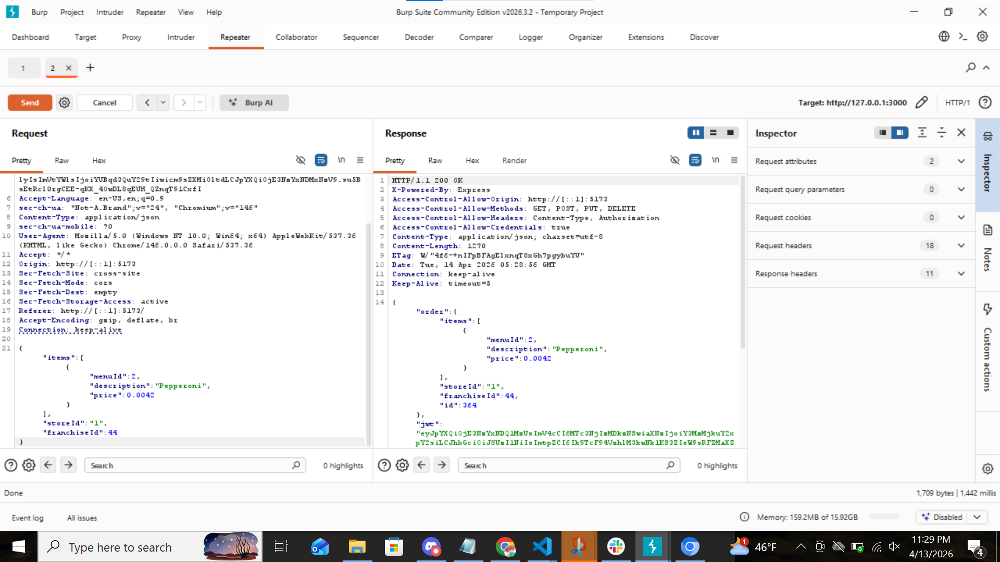
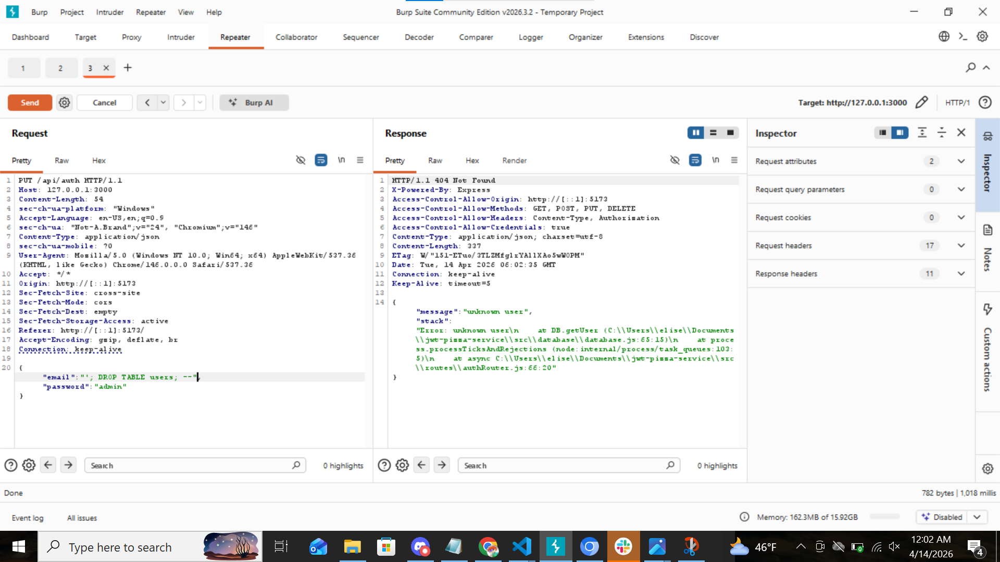
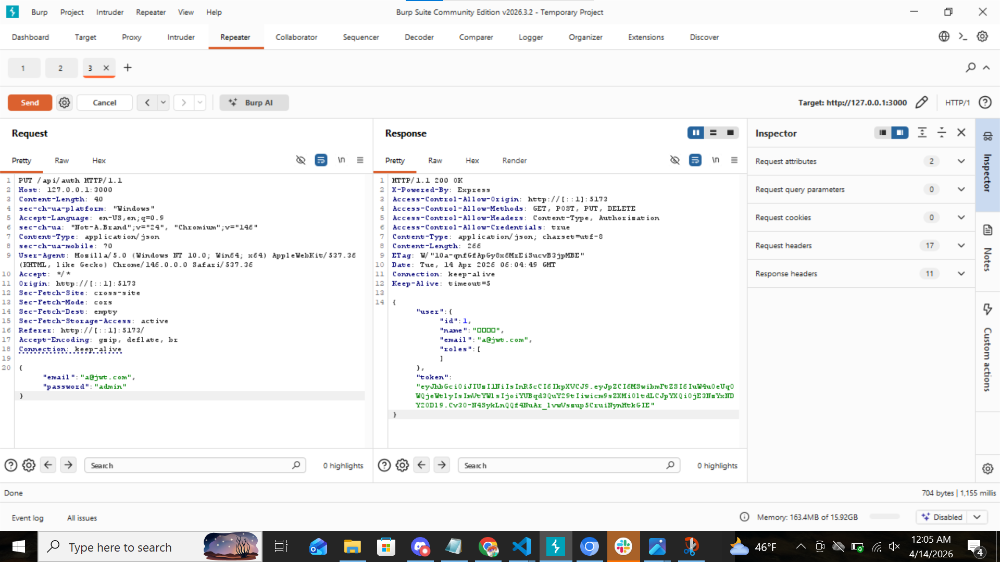

# 1
| Item           | Result                                                                         |
| -------------- | ------------------------------------------------------------------------------ |
| Date           | June 13, 2026                                                                  |
| Target         | pizza.elisew.click                                                       |
| Classification | Broken Access Control                                                                      |
| Severity       | 1                                                                              |
| Description    | Register existing user with different email.                 |
| Images         |    can still log into past user, but admin priveleges may have been removed. |
| Corrections    | Check if user already exists before registering.                                                          |
# 2
| Item           | Result                                                                         |
| -------------- | ------------------------------------------------------------------------------ |
| Date           | June 13, 2026                                                                  |
| Target         | pizza.elisew.click                                                       |
| Classification | Broken Access Control                                                                     |
| Severity       | 0                                                                              |
| Description    | Order with previously logged out user.                 |
| Images         |   . autentication missing.|
| Corrections    | None. Code works properly        |
# 3
| Item           | Result                                                                         |
| -------------- | ------------------------------------------------------------------------------ |
| Date           | June 13, 2026                                                                  |
| Target         | pizza.elisew.click                                                       |
| Classification | Broken Access Control                                                                      |
| Severity       | 3                                                                             |
| Description    | Altering the price of the order to $0, -$1000000000, $-1, and $100000000.                 |
| Images         |   . !  .
   .   . could order for 0 and negative 1, but the larger values were out of range.
| Corrections    | double check that price matches database item order price. Don't allow negative numbers or 0.      |
# 4
| Item           | Result                                                                         |
| -------------- | ------------------------------------------------------------------------------ |
| Date           | June 13, 2026                                                                  |
| Target         | pizza.elisew.click                                                       |
| Classification | Broken Access Control                                                                      |
| Severity       | 3                                                                           |
| Description    | change order to non-existent store.                 |
| Images         |   . placed an order with non-existing store|
| Corrections    | check that store exists before ordering   |

# 5
| Item           | Result                                                                         |
| -------------- | ------------------------------------------------------------------------------ |
| Date           | June 13, 2026                                                                  |
| Target         | pizza.elisew.click                                                       |
| Classification | Broken Access Control                                                                     |
| Severity       | 3                                                                            |
| Description    | change order to non-existent franchise.                 |
| Images         |   .  placed an order with non-existing franchise |
| Corrections    | check that franchize exists before ordering   |

# 6
| Item           | Result                                                                         |
| -------------- | ------------------------------------------------------------------------------ |
| Date           | June 13, 2026                                                                  |
| Target         | pizza.elisew.click                                                       |
| Classification | injection                                                                    |
| Severity       | 0                                                                            |
| Description    | SQL injection through user login to try to delete database users. User's were protected                 |
| Images         |   . |
| Images         |   . |
| Images         |   . User delete attempts.|
| Images         |   . User delete attempts did not work. Can still log in previous user.|
| Corrections    | None. code is properly protecting against SQL injections   |
